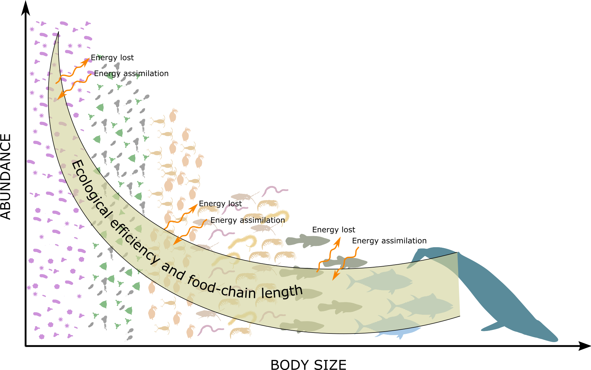
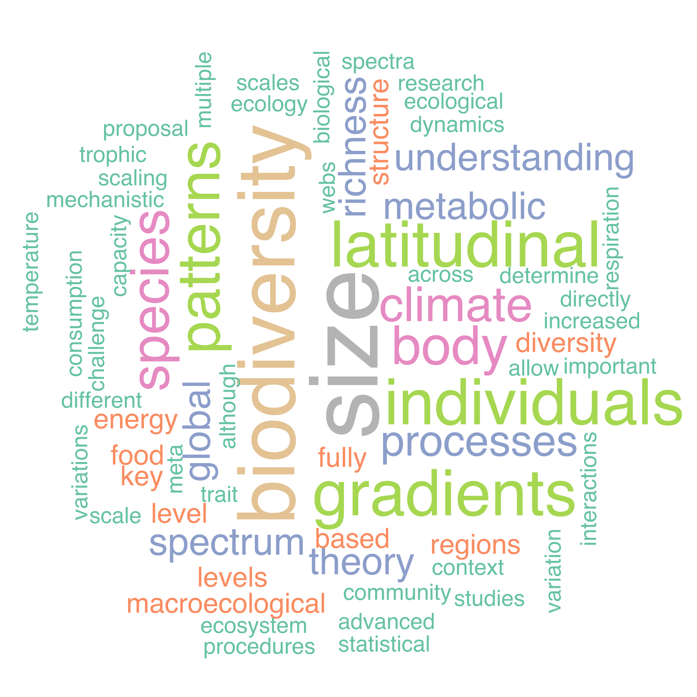
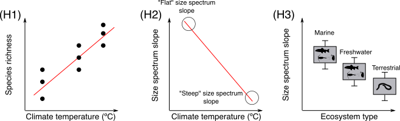
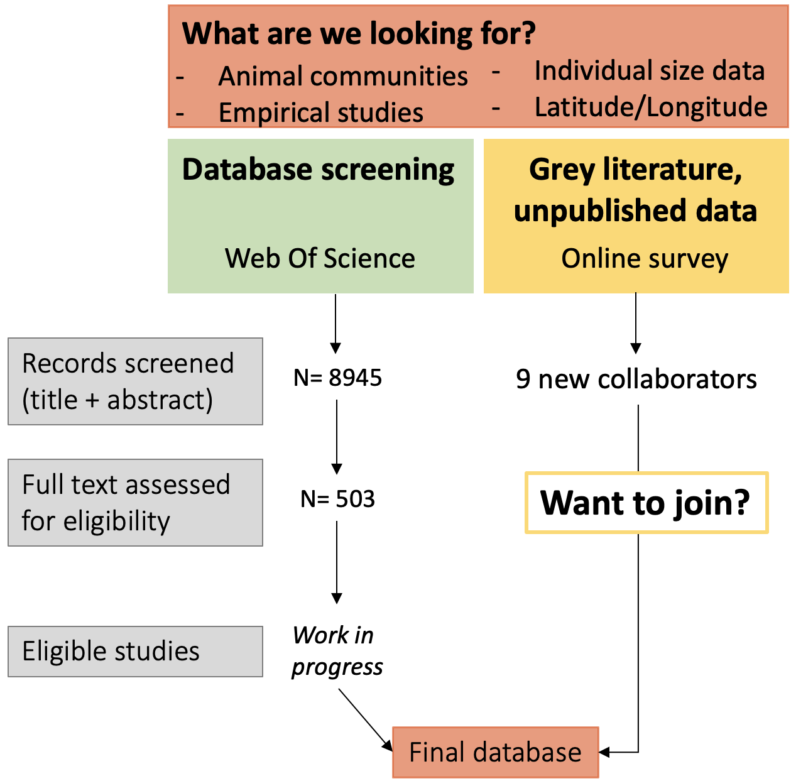
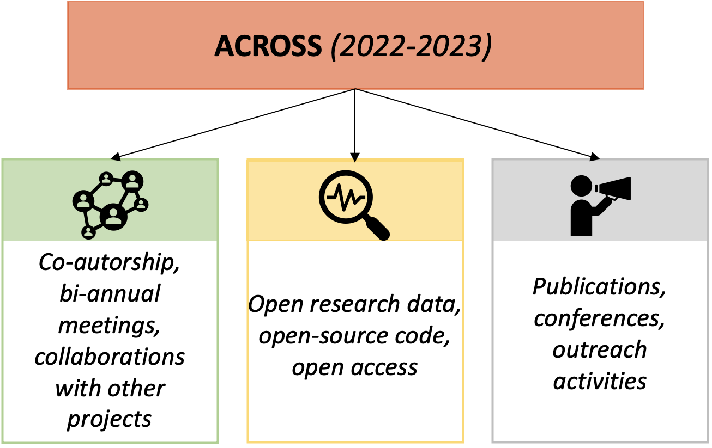
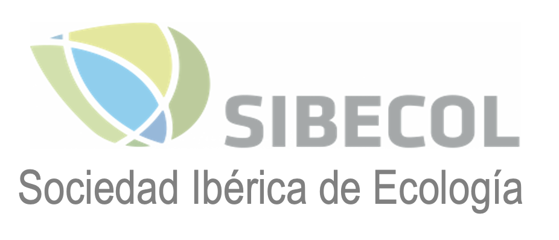

```{r setup, include=FALSE}
knitr::opts_chunk$set(echo = FALSE)
```

<style>
.forceBreak { -webkit-column-break-after: always; break-after: column; }
</style>


# Introduction
<div style='margin-top:70px; line-height: 55pt'>
The latitudinal gradient of biodiversity is a well-recognized ecological pattern on Earth. Although climate has been considered as one of the most important mechanistic drivers, the causes of such species diversity pattern are still debated. So far, latitudinal gradient of biodiversity mainly focuses on species-based processes, while macroecological patterns likely result from individual-based processes. Body size patterns can help to explain diversity patterns because individual **body size** of organisms plays a key role in bioenergetics.


Using a **meta-analysis approach**, the ACROSS project aims to assess local **community size spectrum** (the distribution of individual body sizes regardless of species identity) to better understand **biodiversity patterns at global scales.**
</div>

{width=59%} {width=39%}

# Hypotheses

<div style='margin-top:75px; line-height: 55pt'>
H1. The size-based processes will determine the unexplained variation of **species richness-climate correlations.**
</div>

<div style='margin-top:70px; line-height: 55pt'>
H2. Following the **body-size–temperature rules**, there will be a negative relationship between temperature and size spectrum slope.
</div>

<div style='margin-top:70px; margin-bottom:80px; line-height: 55pt'>
H3. The structure of the size spectrum will be **ecosystem-dependent**. We will observe flatter size spectrum structure in marine than freshwater and terrestrial ecosystems irrespective of the trophic level.
</div>

<div style='margin-top:70px; margin-bottom:70px'>
{width=100%}
</div>

<p class="forceBreak"></p>
# Methods

<center>
{width=80%}
</center>


# Impacts of the Project

<center>
{width=70%}
</center>


# Next Steps
<div style='margin-top:70px; line-height: 55pt'>
With the ACROSS project, we will highlight the importance of using size-based approaches to reflect changes at a global scale, improving the knowledge base for the implementation of a **macroecological theory of bioenergetics** with individual body size as a key element.
</div>


```{r, include=FALSE}
knitr::write_bib(c('knitr','rmarkdown','posterdown','pagedown'), 'packages.bib')
#pagedown::chrome_print("/Users/zeynep/Desktop/GitHub/SIBECOL22 poster/mydraft2.Rmd")
```

# Acknowledgements
<div style='margin-top:50px'>
This project is funded by SIBECOL Advanced early career researchers project grants (Advanced ECR) in 2021.
</div>
{width=49%} {width=49%} 


